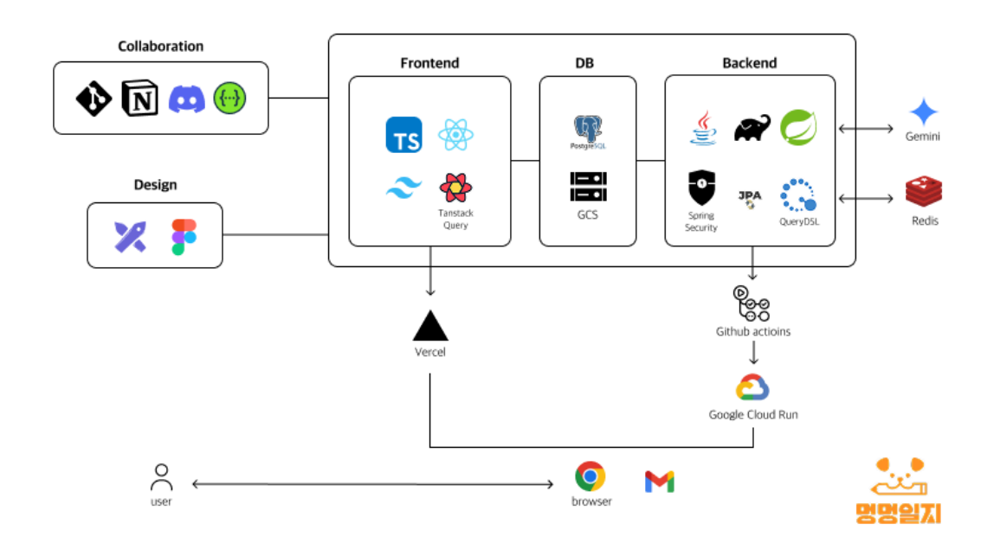
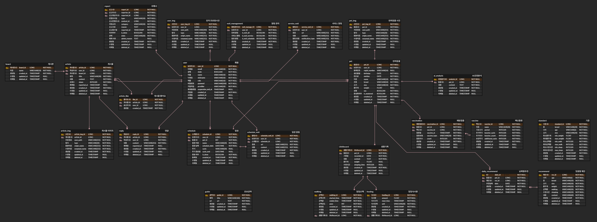

# 🐶강아지 건강 기록/제안 및 소통 서비스 [ 멍멍일지 ]

## 프로젝트 소개

**멍멍일지**는 반려견 보호자들이 사랑스러운 반려견에게 **개인 맞춤형 최적의 일상 루틴**을 제공하고, **다른 보호자들과 유용한 정보와 경험을 공유**하며 궁금증을 해소할 수 있는 반려동물 관리 플랫폼입니다.

**멍멍일지**는 반려견의 개별적인 특성을 고려한 루틴 추천과 보호자 간의 활발한 소통을 통해 더욱 건강하고 행복한 반려 생활을 돕고자 합니다.

 

### 프로젝트 개발 기간

2025.06.26(목) ~ 07.31(목)

 

## 팀원 구성

  <table >
    <tbody>
      <tr>
        <td align="center"><b>강대겸</b></td>
        <td align="center"><b>김예원</b></td>
        <td align="center"><b>박종욱</b></td>
        <td align="center"><b>박현도</b></td>
        <td align="center"><b>안세희</b></td>
      </tr>
      <tr>
        <td align="center"></td>
        <td align="center"></td>
        <td align="center"></td>
        <td align="center"></td>
        <td align="center"></td>
      </tr>
      <tr>
        <td align="center"><a href="https://github.com/KangDaegyeom"><b>@KangDaegyeom</b></a></td>
        <td align="center"><a href="https://github.com/eonwy"><b>@eonwy</b></a></td>
        <td align="center"><a href="https://github.com/JongWook6"><b>@JongWook6</b></a></td>
        <td align="center"><a href="https://github.com/hyundo0328"><b>@hyundo0328</b></a></td>
        <td align="center"><a href="https://github.com/ash-be"><b>@ash-be</b></a></td>
      </tr>
    </tbody>
  </table>

## 시스템 구성도

 

## ERD

 

## 주요 기능
### 대시보드
- 반려동물 프로필(사진, 이름, 나이 등) 조회
- 식사, 산책, 몸무게 등 주요 정보 입력 및 데이터 그래프 제공
- 맞춤형 정보 및 반려견 정서 추측 정보 제공
### 생활기록
- 식사, 산책, 건강 상태(몸무게, 예방접종 등) 기록
- 비정형 기록(일기, 특이사항 등) 기록
- 일정 등록 등
### 커뮤니티(질문게시판 / 자유게시판)
- 다른 반려견 보호자들의 의견 공유
- 게시글 작성, 좋아요, 댓글 등 사용자 인터랙션
### 알림(리마인더)
- 일정, 건강 관리, 예방접종 등 알림/리마인더 제공
### 회원/관리자 페이지
- 회원 관리
- 신고 관리

